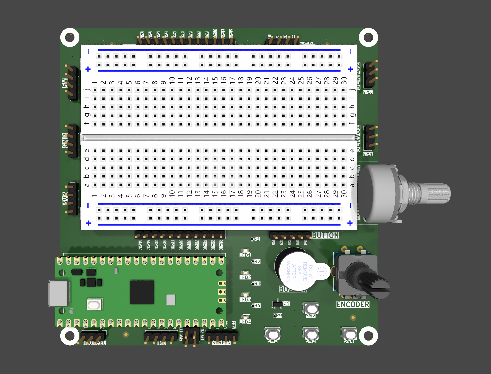

# Pico Breadboard Kit

This is a Raspberry Pi Pico breadboard kit designed for students to learn and experiment with basic electronics and microcontroller programming.

## Features

- **Raspberry Pi Pico** with full GPIO breakout  
- **Four tactile buttons** connected to GPIOs  
- **Four LEDs** with current-limiting resistors  
- **Buzzer** controlled via transistor switch  
- **Rotary encoder with push switch** for interactive input  
- **Potentiometer** connected to ADC input  
- **Headers for external 3.3V and 5V power**  
- **Dedicated I2C connector for screen (SCL/SDA)**  
- **Connector for MPU6050 (I2C accelerometer/gyroscope)**  
- **Servo motor headers (2x) with GPIO control**  
- **Neopixel header** for addressable LED strips  
- Mounting holes for mechanical stability  
- All components are laid out to be easily accessible on a standard breadboard.

## Getting Started

1. Insert the Raspberry Pi Pico into the breadboard.  
2. Connect power via USB.  
3. Upload your code using Thonny or the Pico SDK.  
4. Use the built-in components (buttons, LEDs, buzzer, potentiometer, rotary encoder, servos) to test your logic.  
5. Connect external devices (screen, MPU6050, Neopixel) via the dedicated headers.  

## Schematic

See the included [`v2/pico-breadboard.pdf`](v2/pico-breadboard.pdf) for the detailed wiring.

---

This kit is ideal for beginner to intermediate-level microcontroller projects, robotics experiments, and educational settings.
